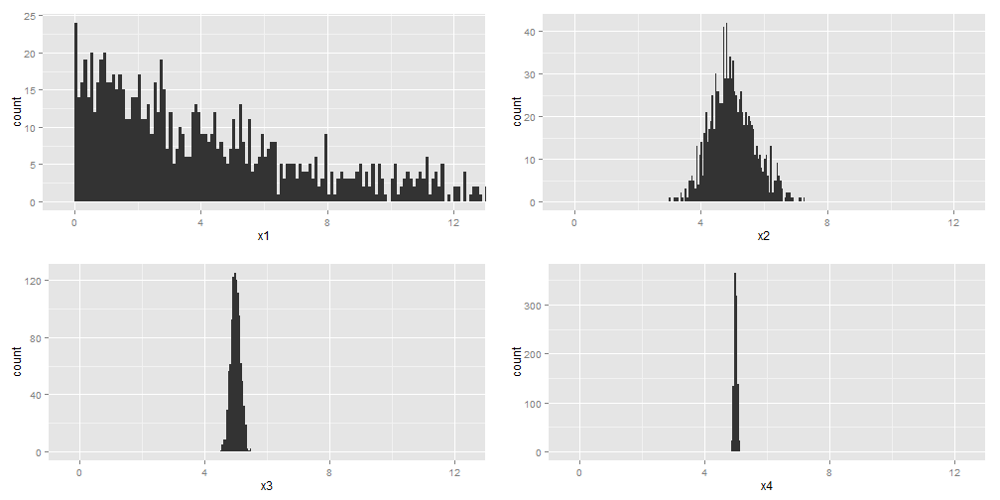

## Goal.

During this short presentation I am going to visualize how the Law of Large Numbers (LLN for short) works.  
Namely I am going to demonstrate the fact of convergence of average of random values to single point even when those random values can evaluate to any real number when they are alone.

--- .class #id 

## Simulation of random values.

```r
x1 = rexp(1000, rate = 1 / 5)
x2 = apply(matrix(rexp(1000*50, rate = 1 / 5), nrow = 50), MARGIN = 2, FUN = mean)
x3 = apply(matrix(rexp(1000*1000, rate = 1 / 5), nrow = 1000), MARGIN = 2, FUN = mean)
x4 = apply(matrix(rexp(1000*10000, rate = 1 / 5), nrow = 10000), MARGIN = 2, FUN = mean)
mean(x1)
```

```
## [1] 5.085033
```

```r
mean(x2)
```

```
## [1] 4.988919
```

```r
mean(x4)
```

```
## [1] 4.999613
```

--- .class #id 

## Visualisation code.

```r
suppressMessages(library(ggplot2))
suppressMessages(library(gridExtra))
g1 = ggplot() + geom_histogram(aes(x = x1), binwidth = 0.1) + coord_cartesian(xlim = c(-1, 13))
g2 = ggplot() + geom_histogram(aes(x = x2), binwidth = 0.05) + coord_cartesian(xlim = c(-1, 13))
g3 = ggplot() + geom_histogram(aes(x = x3), binwidth = 0.05) + coord_cartesian(xlim = c(-1, 13))
g4 = ggplot() + geom_histogram(aes(x = x4), binwidth = 0.05) + coord_cartesian(xlim = c(-1, 13))
g = grid.arrange(g1, g2, g3, g4, ncol = 2)
```

--- .class #id

## Plotting.
 


